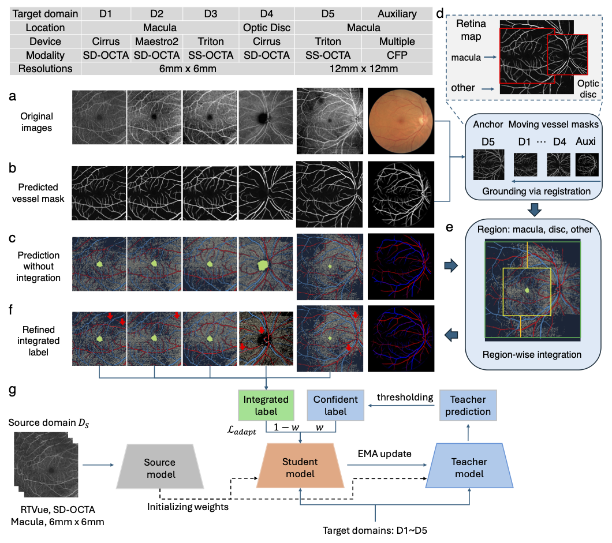
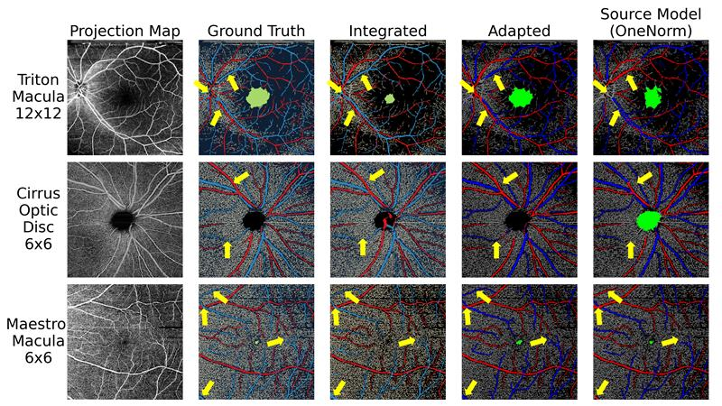

# GrinAdapt: Source-free Multi-Target Domain Adaptation for Retinal Vessel Segmentation


This repository contains Pytorch implementation of our Scaling Retinal Vessel Structural Map Segmentation Through Grounding, Integrating and Adapting Multi-device, Multi-site, and Multi-modal Fundus Domains (GrInAdapt).



# 🔥 News
- **[Jun 2025]** Our paper *GrinAdapt: Source-free Multi-Target Domain Adaptation for Retinal Vessel Segmentation* has been accepted to [MICCAI 2025](https://conferences.miccai.org/2025/en/default.asp)

# Installation
* Install python 3.10.5, pytorch 1.12.0, CUDA 11.6 and other essential packages (Note that using other versions of packages may affect performance.)
* Clone this repo
```
conda env create -f requirement.yaml
conda activate grinadapt
```


# Ground trurth test set

`cd test_set_construction` and specify all path in `create_test_label.sh` and run
```
sh GrInAdapt_Adaption/test_set_construction/create_test_label.sh
```
We will try to put some examples here and later on we also plan to publish our test set to facilitate better benchmarking.


# Training

NOTE: Here because we are not complied to release related image infomation in AI-READI Dataset, we left some path to be changed to incorrprate your image information if you have your own dataset or have the access to the AI-READI dataset. If you want to use it now, please fill all the TODO in `GrInAdapt_Adaption/dataloaders/aireadi_dataset.py` for file path. We plan to provide a dummy file for testing later on.

Download the source domain model from here[TODO] or specify data path in `./train_source.py` and then run python `train_source.py`.

Save the source domain model into folder `./models/`.

Specify the `args.data_dir` for dataset path.

Modified the scripts you want to run and `sh ./path/to/your/script.sh`

## Training GrInAdapt
```
sh GrInAdapt_Adaption/scripts/train_GrInAdapt_model.sh
```

## Training DPL w/ integrated label
```
sh GrInAdapt_Adaption/scripts/train_DPL_w_intergrated_label.sh
```

## Training CMBT w/ ensemble prediction
Download the pseudo labels from here[] or specify  data path in `./generate_pseudo.py` and then run python `generate_pseudo.py`.

Specify the pseudo label path and run
```
sh GrInAdapt_Adaption/scripts/train_CBMT_w_ensemble_prediction.sh
```


# Evaluation
Download the test set from here[] or specify data path in `.test_set_cinstruction/TODO.py` and then run python `TODO.py`.

Save it into the `args.data_dir`.

Specify thead apted model path and run
```
sh GrInAdapt_Adaption/scripts/eval.sh
```

# Samples Comparision




# Arguments

- **`-g, --gpu`**
  GPU device ID to use.

- **`--model-file`**
  Path to the model file.

- **`--save_root`**
  Root directory for saving results.

- **`--file_name`**
  Name of the output file or experiment.

- **`--fail_image_path`**
  Path for low quality or failed registration images

- **`--npz_path`**
  Path for proto pseudo labels for `train_target_ts_pseudo.py`

- **`--model`**
  Model architecture to use (e.g., `IPN_V2`).

- **`--out-stride`**
  Output stride for the network.

- **`--sync-bn`**
  Whether to use synchronized batch normalization.

- **`--freeze-bn`**
  Whether to freeze batch normalization parameters.

- **`--epoch`**
  Number of training epochs.

- **`--lr`**
  Initial learning rate.

- **`--lr-decrease-rate`**
  Factor by which the learning rate is multiplied at each decrease step.

- **`--lr-decrease-epoch`**
  Interval (in epochs) for applying the learning rate decrease.

- **`--data-dir`**
  Root directory of the dataset.

- **`--dataset`**
  Dataset name to use (e.g., `AIREADI`).

- **`--model-source`**
  Source name for the model (e.g., `OCTA500`).

- **`--batch-size`**
  Batch size for training.

- **`--model-ema-rate`**
  Exponential moving average decay rate for model parameters.

- **`--pseudo-label-threshold`**
  Confidence threshold for generating pseudo labels.

- **`--mean-loss-calc-bound-ratio`**
  Ratio that defines the boundary for mean loss calculation.

- **`--in_channels`**
  Number of input channels.

- **`--n_classes`**
  Total number of output classes.

- **`--method`**
  Method name or architecture variant (e.g., `IPN_V2`).

- **`--ava_classes`**
  Number of available classes (for certain tasks).

- **`--proj_map_channels`**
  Number of projection map channels.

- **`--get_2D_pred`**
  Whether to produce 2D predictions.

- **`--proj_train_ratio`**
  Training size ratio for projection mapping.

- **`--dc_norms`**
  Normalization type for double convolution layers.

- **`--checkpoint-interval`**
  Interval (in steps) at which to save model checkpoints.

- **`--resume_ckpt_path`**
  Path to a checkpoint file to resume training.

- **`--run_all_success`**
  Whether to run training and testing on all success cases.

- **`--mask_optic_disc`**
  Whether to mask out the optic disc region.

- **`--annealing-factor`**
  Type of annealing schedule (e.g., `cos`) used for the loss.

- **`--save_npy`**
  Whether save the .npy file for each training or evlauation process images


# Repo Structure

```
GrInAdapt_Adaption/
│── dataloaders/                   # Data loading and transformation utilities
│   │── aireadi_dataloader.py      # Data loader for AI-READI dataset
│   │── aireadi_dataset.py         # AI-READI dataset handling
│   │── custom_octa_transform.py   # Custom transformations for OCTA images for strong and weak agumentations
│   └── utils.py                   # Utility functions for data handling
│
│── scripts/                       # Training and evaluation scripts
│   └── ...
│
│── test_set_construction/         # Scripts for constructing test datasets
│   │── create_test_label.py       # Python script for creating ground truth test labels
│   └── create_test_label.sh       # Shell script for test label creation
│
│── utils/                         # General utilities for training and evaluation
│   │── losses.py                  # Loss function implementations
│   │── metrics.py                 # Metric computation functions
│   └── Utils.py                   # General helper functions
│
│── eval_image.py                  # Evaluating during training process
│── eval.py                        # Evaluation outside training process
│── generate_pseudo.py             # Pseudo-label generation for CBMT w/ ensemble prediction
│── model_with_dropout.py          # Model implementation with dropout layers (only use in generate_pseudo.py)
│── model.py                       # Core model implementation
│── train_target_single_model.py   # Training script for DPL structure
│── train_target_ts_pseudo.py      # Training script for teacher student structure on CBMT method
│── train_target_ts.py             # Training script for teacher student structure on GrInAdapt(Ours) method
└── training_utils.py              # Helper functions for training
```


# How the result directory will look like:

## Training Results

```
training_result_GrInAdapt
│── eval/
│   │── metrics_summary.txt
│   │── metrics.json
│   │── per_class_dice_scores_all.csv
│   └── ...
│
│── images/
│   │── Evaluation_batch_idx0.png
│   │── Evaluation_batch_idx0.npy (If args.save_npy is True)
│   │── ...
│   │── Training_epoch0_step100.png
│   └── ...
│
│── 20250101.txt
│── args.json
│── checkpoint_epoch0_step100.pth.tar
│── last.pth.tar
└── metrics_summary_{epoch and step name}.txt
```


## Evaluation Results

```
evaluation_result_GrInAdapt
│── eval/
│   │── metrics_summary.txt
│   │── metrics.json
│   │── per_class_dice_scores_all.csv
│   └── ...
│
│── images/
│   │── Evaluation_batch_idx0.png
│   │── Evaluation_batch_idx0.npy (If args.save_npy is True)
│   └── ...
│
│── 20250101.txt
│── args.json
│── metrics_summary_both.txt
│── metrics_summary_mean.txt
└── metrics_summary_std.txt
```


# Acknowledgement

We would like to thank the great work of the following open-source projects: [DPL](https://github.com/cchen-cc/SFDA-DPL), [CBMT](https://github.com/lloongx/SFDA-CBMT), and [CPR](https://github.com/xmed-lab/CPR).
